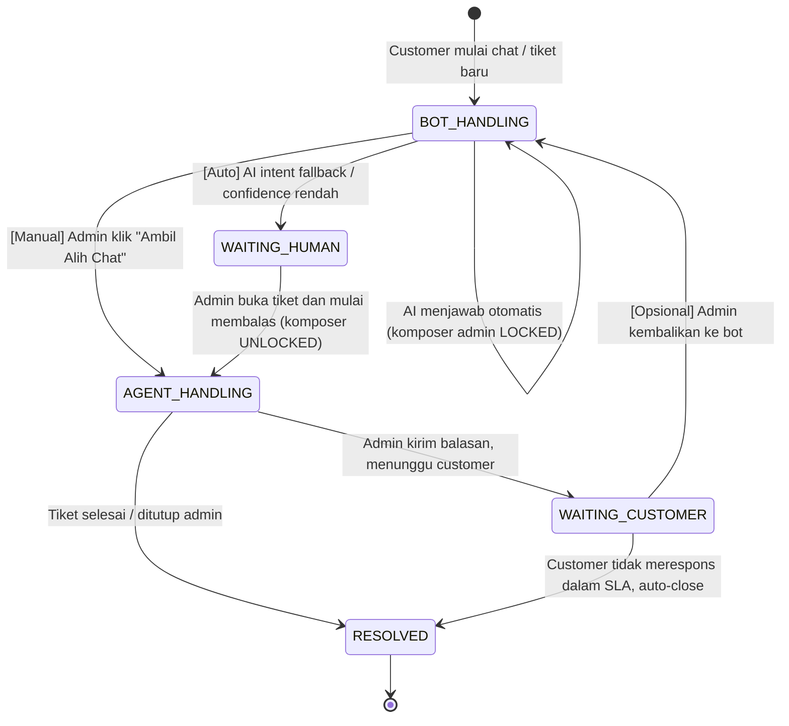

# Tech Planning: AI Chatbot to Human Handoff & Edge Cases Architecture
**Project:** MobilJuragan (CV. Mobil Juragan Express Transport, Merauke)  
**Tujuan:** Arsitektur transisi percakapan dari AI Chatbot ke staf/admin manusia di Flutter Customer App dan Next.js Admin Dashboard (layar `Customer Care`), beserta mitigasi edge case operasional.
**Status dokumen:** planning. Belum masuk implementasi runtime. Fitur chatbot AI sendiri masih di luar MVP (lihat `docs/PLANNING_TECH_STACK_DAN_ROADMAP.md` §1 line 42), sehingga dokumen ini hanya menjadi bahan diskusi tim, bukan pekerjaan selesai.

---

## 1. Latar Belakang dan Inti Masalah

Pada aplikasi chat konvensional, indikator pesan belum dibalas umumnya berupa badge angka (mis. badge hijau `1`) yang dipicu oleh `unread_count > 0` dari pengirim. Aturan ini memadai bila hanya ada manusia di kedua sisi.

Jika sistem mengintegrasikan AI Chatbot, ada tiga masalah pada aturan badge tersebut:

1. Setelah AI menjawab otomatis, baris pesan terakhir di database adalah *outbound* (dari bot). Pada dashboard admin yang sederhana, percakapan terlihat "sudah selesai", padahal customer bisa jadi belum puas atau meminta hal yang tidak bisa dijawab bot (negosiasi sewa khusus, armada darurat, atau kebutuhan operasional lain di Merauke).
2. Tanpa penanda visual dan tanpa penguncian komposer (*chat lock*), admin tidak bisa memisahkan tiket yang aman ditangani bot dari tiket yang butuh intervensi manusia.
3. Bot yang terus menjawab saat admin sudah mengambil alih akan menyebabkan pesan tumpang tindih (lihat edge case §8 nomor 1).

Solusi yang ditawarkan dokumen ini memisahkan dua hal: **status workflow tiket** (apa yang sedang menunggu) dan **mode penanganan** (siapa yang sedang menangani: bot atau manusia). Pemisahan ini menjadi dasar untuk state machine, schema, dan UI.

---

## 2. Status Workflow vs Mode Penanganan (pemisahan konsep)

Status workflow tiket (`TicketStatus`) menjelaskan apa yang ditunggu sistem. Mode penanganan (`handlingMode`) menjelaskan siapa yang sedang menulis.

| Status workflow | Arti | Mode penanganan yang valid |
|---|---|---|
| `OPEN` | Tiket baru, belum diproses siapa pun. | `BOT` (default), `HUMAN` |
| `WAITING_HUMAN` | Bot sudah menyatakan eskalasi; tiket menunggu admin membuka dan mulai membalas. | `HUMAN` saja. Bot di-mute sampai admin mengambil alih. |
| `IN_PROGRESS` | Admin tertentu sudah mengirim minimal satu balasan (`assignedAdminId` terisi). | `HUMAN` |
| `WAITING_CUSTOMER` | Admin sudah mengirim balasan, menunggu balasan customer berikutnya. | `HUMAN` |
| `RESOLVED` | Admin menutup tiket karena sudah selesai. | none |
| `CLOSED` | Tiket ditutup permanen (admin atau auto-policy). | none |

Mode penanganan:

- `BOT`: AI yang menjawab, komposer admin terkunci.
- `HUMAN`: Admin yang menjawab, komposer admin terbuka.

**Alasan pemisahan.** Menyimpan `WAITING_HUMAN` di kolom `TicketStatus` saja tanpa field mode akan membuat sistem tidak tahu apakah AI boleh bicara. Menyimpan `isAiActive` saja tanpa status workflow akan membuat alur "tiket ditutup" sulit diekspresikan. Dengan dua field, setiap transisi jelas dan dapat diaudit (lihat §6).

---

## 3. State Diagram



Catatan transisi:

- Transisi apa pun yang mengubah mode penanganan wajib menulis satu baris `TicketMessage` dengan `senderType = SYSTEM` (lihat §6) agar audit trail menjelaskan alasan perubahan.
- Transisi dari `BOT_HANDLING` langsung ke `AGENT_HANDLING` tanpa melewati `WAITING_HUMAN` hanya boleh dipicu manual oleh admin. Bot tidak boleh mengubah mode sendiri tanpa mencatat alasan transisi.

---

## 4. Definisi State

### 4.1 `BOT_HANDLING` (default, bot aktif)

- AI menjawab pesan customer.
- Komposer admin di dashboard **terkunci (read-only)** dengan placeholder: *"Chat sedang ditangani AI. Klik 'Ambil Alih Chat' untuk membalas manual."*
- Tombol aksi utama di header tiket: `[Ambil Alih Chat]` (warna Navy/Teal sesuai token).
- Status chip di kartu tiket: `[Ditangani AI]` (warna abu netral atau Soft Teal).

### 4.2 `WAITING_HUMAN` (eskalasi, menunggu admin)

Terpicu otomatis saat AI mendeteksi kebutuhan manusia atau customer meminta manusia. Transisi dilakukan tiga langkah agar customer tidak mengira chat rusak:

1. **Pesan transisi.** AI mengirim satu pesan ke customer sebelum bot di-mute:
   > "Baik, untuk pertanyaan ini saya teruskan ke staf admin operasional kami. Mohon ditunggu sebentar, admin manusia akan segera membalas di sini."
2. **Bot di-mute.** Setelah pesan transisi tersimpan ke `ticket_messages` dengan `senderType = AI_BOT` dan `isTransitionMessage = true`, service melakukan commit atomik untuk mengubah `handlingMode` ke `HUMAN` dan `status` ke `WAITING_HUMAN`. Handler pesan masuk membaca mode terbaru setelah commit dan tidak memanggil engine AI.
3. **Dashboard aktif.** Kartu tiket pindah ke urutan teratas antrean "Perlu Tindakan", badge merah menyala, komposer admin terbuka, notifikasi browser/suara dibunyikan.

Status chip di kartu tiket: `[Butuh Admin]` (warna merah atau oranye tegas).

### 4.3 `AGENT_HANDLING` (sedang ditangani staf)

- Admin sudah mengirim minimal satu balasan (`assignedAdminId` terisi, `firstAgentReplyAt` tercatat).
- Status workflow tiket berpindah ke `IN_PROGRESS`.
- Bot tetap nonaktif sampai tiket selesai atau admin secara eksplisit mengembalikan ke bot.

Status chip di kartu tiket: `[Aktif - Anda]` (warna Navy atau hijau, mengikuti token).

### 4.4 Status `WAITING_CUSTOMER` (admin sudah balas, menunggu customer)

Tidak di-highlight di draf lama, tetapi ditambahkan untuk menutup alur:

- Admin sudah mengirim minimal satu balasan dan tidak ada admin lain yang menulis belakangan.
- `handlingMode = HUMAN`, komposer admin tetap terbuka untuk klarifikasi lanjutan.
- Bot tetap nonaktif sampai customer membalas atau admin mengembalikan tiket ke bot.

Transisi dari `AGENT_HANDLING` ke `WAITING_CUSTOMER` tidak menghapus `assignedAdminId`; admin yang sama masih bisa melanjutkan balasan.

---

## 5. UI/UX Dashboard Admin (`Screen / Customer Care`)

Acuan visual: `docs/figma-raw/dashboard/09-customer-care.png`.

### 5.1 Kartu tiket masuk (daftar kiri)

- **Badge merah di pojok kanan atas:** dot berdenyut atau badge angka merah yang menghitung pesan customer sejak eskalasi (`unreadAfterEscalation`).
- **Chip status:** lihat §4.1 sampai §4.3.
- **SLA timer:** teks kecil di bawah chip, format "Menunggu X mnt" (diperbarui tiap menit dari `lastEscalationAt`; jika tiket belum pernah dieskalasi, gunakan `createdAt`).

### 5.2 Area chat panel (kanan)

- **Banner sistem (*System Event Divider*):** saat transisi mode terjadi, sistem menyisipkan baris dengan `senderType = SYSTEM` di posisi timestamp transisi. Contoh tampilan:
  > `─── AI mengalihkan ke Admin Manusia (Alasan: Permintaan Customer) • 06.25 WIT ───`
- **Komposer admin:**
  - Mode `BOT_HANDLING`: input disabled, tombol `[Ambil Alih Chat]`.
  - Status `WAITING_HUMAN` dan `handlingMode = HUMAN`: input aktif, tombol `[Kirim Balasan]`; pengiriman pertama mengisi `assignedAdminId` secara atomik.
  - Status `IN_PROGRESS` atau `WAITING_CUSTOMER` dengan `assignedAdminId` milik admin yang login: input aktif. Tombol `[Kembalikan ke AI Bot]` hanya tersedia pada `WAITING_CUSTOMER` dan mengikuti izin role.
  - Jika tiket sudah diambil admin lain, input tidak dapat mengirim balasan dan UI menampilkan identitas admin yang ditugaskan.

---

## 6. Penyesuaian Data Model (`schema.prisma`)

Diff di bawah adalah **usulan perubahan**, bukan hasil yang sudah di-migrate. Bagian ini menjelaskan apa yang harus ditambah ke `services/api/prisma/schema.prisma` agar fitur handoff bisa diimplementasikan, beserta alasan setiap field. Daftar ini dibandingkan dengan kondisi schema saat ini di akhir bagian.

```prisma
enum TicketStatus {
  OPEN
  WAITING_HUMAN
  IN_PROGRESS
  WAITING_CUSTOMER
  RESOLVED
  CLOSED
}

enum TicketHandlingMode {
  BOT
  HUMAN
}

enum MessageSenderType {
  CUSTOMER
  AI_BOT
  ADMIN
  SYSTEM
}

model SupportTicket {
  id                  String              @id @default(uuid())
  ticketNumber        String              @unique
  customerId          String
  customer            User                @relation(fields: [customerId], references: [id])
  assignedAdminId     String?             // User.id staf/admin yang ambil alih
  handlingMode        TicketHandlingMode  @default(BOT)
  status              TicketStatus        @default(OPEN)
  unreadHumanCount    Int                 @default(0)     // badge merah di dashboard
  lastEscalationAt    DateTime?           // acuan SLA timer setelah eskalasi
  firstAgentReplyAt   DateTime?           // penanda sudah diambil alih admin manusia
  messages            TicketMessage[]
  createdAt           DateTime            @default(now())
  updatedAt           DateTime            @updatedAt

  @@index([status])
  @@index([customerId])
  @@index([assignedAdminId])
  @@index([handlingMode, status])
  @@map("support_tickets")
}

model TicketMessage {
  id                   String            @id @default(uuid())
  ticketId             String
  ticket               SupportTicket     @relation(fields: [ticketId], references: [id])
  senderId             String?           // nullable saat senderType SYSTEM
  sender               User?             @relation(fields: [senderId], references: [id])
  senderType           MessageSenderType @default(CUSTOMER)
  body                 String
  isTransitionMessage  Boolean           @default(false) // penanda pesan transisi §4.2
  sentAt               DateTime          @default(now())

  @@index([ticketId, sentAt])
  @@map("ticket_messages")
}

model TicketEscalationLog {
  id            String       @id @default(uuid())
  ticketId      String
  ticket        SupportTicket @relation(fields: [ticketId], references: [id])
  fromMode      TicketHandlingMode
  toMode        TicketHandlingMode
  reason        String       // mis. "AI_INTENT_FALLBACK" | "CUSTOMER_REQUEST" | "ADMIN_TAKEOVER"
  confidence    Float?       // skor confidence AI saat fallback (jika ada)
  triggeredById String?      // userId admin (jika manual) atau null
  createdAt     DateTime     @default(now())

  @@index([ticketId, createdAt])
  @@map("ticket_escalation_logs")
}
```

Konsistensi dengan schema yang sudah ada (`services/api/prisma/schema.prisma`):

- `TicketStatus` saat ini hanya memiliki `OPEN`, `IN_PROGRESS`, `WAITING_CUSTOMER`, `RESOLVED`, dan `CLOSED`; usulan menambahkan `WAITING_HUMAN` harus diperlakukan sebagai migration yang perlu diuji terhadap data development.
- Model `SupportTicket` saat ini memiliki `title`, `category`, dan `description`, tetapi belum memiliki field handoff (`assignedAdminId`, `handlingMode`, `unreadHumanCount`, `lastEscalationAt`, `firstAgentReplyAt`). Field baru yang memiliki default atau nullable dapat ditambahkan bertahap, tetapi migrasi tetap harus direview dan diverifikasi.
- Model `TicketMessage` saat ini memakai `senderId String` dan `isCustomer Boolean`; usulan menggantinya dengan `senderId String?`, relasi `sender User?`, `senderType`, dan `isTransitionMessage` adalah perubahan model, bukan tambahan dokumentasi saja. Kode yang memakai `isCustomer` dan relasi `User.sentMessages` harus diperbarui bersamaan.
- `MessageSenderType.SYSTEM` tanpa pengirim manusia adalah alasan utama `senderId` diusulkan nullable. Alternatif yang lebih konservatif adalah mempertahankan `senderId` non-nullable dengan identitas system user yang khusus. Tim harus memilih satu pendekatan sebelum migration.
- Penambahan tabel `TicketEscalationLog` adalah tabel baru dan perlu relation field tambahan pada model `SupportTicket` serta `User` bila `triggeredById` memakai foreign key. Bagian contoh schema harus dilengkapi sebelum `prisma generate` dijalankan.
- Prisma 7 memakai `prisma.config.ts` dengan `DATABASE_URL` dan runtime singleton `db` memakai `PrismaPg`; migration untuk fitur ini harus memakai pola yang sama, bukan membuat datasource URL baru.

---

## 7. Kontrak API (usulan endpoint baru)

Endpoint di bawah adalah **usulan** untuk ditambahkan ke `docs/api/openapi.yaml` ketika tim memutuskan untuk masuk implementasi. Konsistensi format mengikuti `services/api/src/utils/response.ts` (`{ status: "ok", data }` untuk sukses, `{ error: { code, message, details } }` untuk error).

| Method | Path | Tujuan | Aktor | Error code yang mungkin |
|---|---|---|---|---|
| `GET` | `/api/v1/tickets` | Daftar tiket customer (mobile) atau semua tiket (admin dengan filter). | Customer / Staff / Admin | `UNAUTHORIZED` |
| `POST` | `/api/v1/tickets` | Buat tiket baru. Body: `{ title, category, description, firstMessage }`. | Customer | `VALIDATION_ERROR` |
| `GET` | `/api/v1/tickets/:ticketId` | Detail tiket + pesan. | Customer (miliknya) / Staff / Admin | `TICKET_NOT_FOUND`, `FORBIDDEN` |
| `POST` | `/api/v1/tickets/:ticketId/messages` | Kirim pesan baru. Bot route aktif hanya jika `handlingMode = BOT`. | Customer / Staff / Admin / AI Bot (server-side) | `TICKET_LOCKED`, `TICKET_CLOSED` |
| `POST` | `/api/v1/admin/tickets/:ticketId/takeover` | Admin mengambil alih chat. Transisi `BOT_HANDLING → AGENT_HANDLING`. Wajib mengirim pesan transisi bot terlebih dulu jika belum ada. | Staff / Admin | `TICKET_ALREADY_TAKEN`, `TICKET_CLOSED` |
| `POST` | `/api/v1/admin/tickets/:ticketId/return-to-bot` | Admin mengembalikan tiket ke bot. | Staff / Admin | `TICKET_NOT_WAITING`, `TICKET_CLOSED` |
| `POST` | `/api/v1/admin/tickets/:ticketId/resolve` | Tandai tiket selesai. | Staff / Admin | `TICKET_CLOSED` |
| `POST` | `/api/v1/admin/tickets/:ticketId/reopen` | Buka kembali tiket yang sudah `RESOLVED`/`CLOSED`. | Staff / Admin | `TICKET_ALREADY_OPEN` |
| `GET` | `/api/v1/admin/tickets/queue` | Antrean tiket yang butuh aksi (`WAITING_HUMAN`, `IN_PROGRESS` tertua). Untuk badge merah dan sorting di dashboard. | Staff / Admin | `UNAUTHORIZED` |

Error code baru (perlu didefinisikan di `services/api/src/utils/response.ts` dan `docs/api/openapi.yaml`):

- `TICKET_NOT_FOUND` (404)
- `TICKET_LOCKED` (409, ketika mode `BOT` dan admin mencoba mengirim tanpa takeover)
- `TICKET_ALREADY_TAKEN` (409, ketika admin lain sudah ambil alih)
- `TICKET_CLOSED` (410, ketika tiket sudah `RESOLVED`/`CLOSED` dan tidak menerima pesan baru)
- `TICKET_NOT_WAITING` (409, ketika admin mencoba return-to-bot tapi status tidak `WAITING_CUSTOMER`)
- `TICKET_ALREADY_OPEN` (409, pada reopen)

---

## 8. Analisis Edge Cases dan Mitigasi Teknis

| No | Skenario | Potensi masalah | Mitigasi teknis |
|---|---|---|---|
| 1 | **Race condition: admin ambil alih saat AI streaming.** | Pesan parsial bot dan pesan admin tumpang tindih. | Server-side: transisi `BOT -> HUMAN` melewati **satu titik koordinator** (lihat §8 nomor 10). Permintaan admin "Ambil Alih" hanya sukses setelah baris `SYSTEM` "AI mengalihkan" tersimpan dan `handlingMode` di-commit ke database. Pesan parsial yang masih di-buffer di pipeline LLM dibatalkan (`AbortController.abort()`); hanya baris `AI_BOT` lengkap yang tersimpan di `ticket_messages`. |
| 2 | **Customer spam pesan saat menunggu admin.** | Bot hidup lagi karena webhook baru. | Guard di handler pesan masuk: jika `handlingMode = HUMAN`, **lewati** jalur LLM. Pesan tetap di-append ke `ticket_messages` dengan `senderType = CUSTOMER` dan `unreadHumanCount` di-increment. Tidak ada panggilan ke engine AI. |
| 3 | **Handoff di luar jam operasional.** | Customer minta manusia malam hari; tidak ada admin standby. | Bot menjawab dengan template (§4.2) yang menyebut jam operasional. Status workflow tetap `WAITING_HUMAN` agar muncul di antrean admin saat jam buka. Tidak ada fallback ke status `OPEN`; tiket menunggu begitu saja. |
| 4 | **Admin kembalikan chat ke bot.** | Setelah admin menjawab kendala khusus, customer hanya bertanya FAQ umum. | Endpoint `POST /api/v1/admin/tickets/:ticketId/return-to-bot` hanya valid saat status `WAITING_CUSTOMER`. Sistem menyisipkan baris `SYSTEM` "Chat dikembalikan ke AI Bot", `handlingMode = BOT`, `assignedAdminId = null`, `unreadHumanCount = 0`. |
| 5 | **Customer menutup aplikasi saat menunggu.** | Admin balas, customer tidak melihat karena tidak di layar chat. | Saat admin mengirim pesan di mode `HUMAN`, backend mengirim push notification via FCM ke perangkat customer jika customer punya token FCM. Token FCM disimpan di tabel `User` (perlu field tambahan, di luar scope dokumen ini). Sampai FCM aktif, fallback: notifikasi in-app dengan bell icon di Flutter. **Risiko:** dependency Flutter tambahan (`firebase_messaging`) dan konfigurasi iOS/Android belum ada di workspace; pakai in-app dulu sebelum FCM. |
| 6 | **Intent flapping (false positive).** | AI salah mengira pesan basa-bali sebagai permintaan manusia. | Dua lapis validasi intent: (a) skor confidence dari classifier + reranker (RAG FAQ), threshold misal `>= 0.6` untuk eskalasi; (b) jika confidence di zona abu-abu (`0.4 ≤ score < 0.6`), AI mengirim pesan konfirmasi dengan dua tombol `[Ya, Hubungkan Admin]` dan `[Tidak, Lanjut Chat]` (disimpan sebagai `TicketMessage` `senderType = AI_BOT`, lalu diproses sebagai event dari customer). |
| 7 | **Silent drop saat handoff.** | AI mendadak diam, customer mengira aplikasi error. | Wajib menulis satu baris `AI_BOT` dengan `isTransitionMessage = true` sebelum `handlingMode` diubah ke `HUMAN` (lihat §4.2). Transisi yang tidak disertai baris transisi ditolak oleh validator di service layer. |
| 8 | **Customer mengganti nomor HP saat percakapan berlangsung.** | Tiket lama menjadi yatim. | Saat `POST /auth/otp/verify` membuat user baru atau mengubah `phoneNumber`, tiket lama tetap menunjuk ke user lama. Operator admin melihat `customer.phoneNumber` di header tiket dan memutuskan manual apakah akan merge atau buat tiket baru. (Diputuskan terpisah; tidak dalam lingkup dokumen ini.) |
| 9 | **Dua admin membuka tiket yang sama.** | Dua admin mengirim balasan bersamaan. | Saat admin pertama menekan "Ambil Alih", `assignedAdminId` di-set di transaction dengan `WHERE handlingMode = BOT`. Query kedua yang tiba setelah commit akan gagal (`affected = 0`) dan mendapat error `TICKET_ALREADY_TAKEN`. |
| 10 | **Bot merespons pesan yang dikirim saat transisi berlangsung.** | Pesan bot tumpang tindih dengan pesan transisi. | Transisi §4.2 dilakukan dalam satu transaksi Prisma: insert baris transisi + update `handlingMode`. Webhook pesan masuk yang tiba sebelum transaksi commit akan melihat `handlingMode = BOT` lama dan terjawab bot; webhook setelah commit akan melihat `HUMAN` dan masuk §8 nomor 2. Batas waktu commit ditargetkan < 200 md; jika gagal, retries webhook diproses ulang dengan status terbaru. |

---

## 9. Konsistensi dengan Arsitektur yang Sudah Ada

Bagian ini membandingkan usulan di dokumen ini dengan pondasi yang sudah dibangun (status logbook M3-M5 + `services/api/src`).

### 9.1 Middleware otentikasi (`services/api/src/middleware/auth.ts`)

- `requireAuth` sudah memverifikasi JWT dan memastikan `isActive = true` lewat `db.user.findUnique`.
- `requireRole(...roles)` sudah membatasi endpoint berdasarkan `CUSTOMER`, `STAFF`, dan `ADMIN`.
- Route tiket belum terdaftar di `services/api/src/routes/v1/index.ts`. Saat fitur dikerjakan, tambahkan route setelah keputusan scope disetujui.
- Akses per-tiket sebaiknya ditangani oleh service layer. Service memeriksa apakah customer adalah pemilik tiket, atau apakah staf/admin boleh mengambil dan mengubah tiket tersebut. Jangan hanya mengandalkan guard di Next.js.

### 9.2 Format respons (`services/api/src/utils/response.ts`)

- `sendSuccess` dan `sendError` sudah menyediakan envelope `{ status, data }` dan `{ error: { code, message, details } }`.
- `errorHandler` sudah menangani `AppError`, `ZodError`, JSON invalid, dan error tak terduga.
- Error code baru (§7) perlu dipakai melalui `AppError` agar status HTTP dan envelope tetap konsisten. Jangan menambah format response khusus untuk tiket.

### 9.3 Logging dan database client (`services/api/src/logger.ts`, `services/api/src/db.ts`)

- Pino sudah terpasang dan dipakai di route auth. Logger me-redact header authorization, `passwordHash`, dan `otpHash`.
- `db.ts` sudah mengekspor satu instance `PrismaClient` dengan `PrismaPg` adapter. `TicketTransitionService` harus memakai instance ini dan transaction Prisma, bukan membuat client baru pada setiap request.
- Untuk audit handoff, gunakan logger yang sama dengan field `ticketId`, `fromMode`, `toMode`, `actorId`, dan `reason`. `TicketEscalationLog` menjadi jejak persisten; logger menjadi jejak operasional untuk debugging.

### 9.4 Keamanan kriptografi dan rahasia

- `hashOtp` memakai `crypto.createHmac('sha256', OTP_SALT)`. Untuk OTP 6-digit yang sudah membawa entropi sendiri, SHA-256 HMAC cukup. Untuk **password admin** kode yang ada sudah benar memakai `bcrypt` dengan `genSalt(10)`.
- Pipeline LLM memakai API key dari env (`OPENAI_API_KEY` atau setara) dan disimpan di `services/api/.env`. File `.env` sudah masuk `.gitignore`; hanya `.env.example` yang di-commit tanpa nilai rahasia.
- Push notification FCM (§8 nomor 5) butuh service account key. Simpan di env, jangan commit. Flutter perlu menambahkan dependency `firebase_messaging` dan file `google-services.json` / `GoogleService-Info.plist`, yang juga harus masuk `.gitignore`.
- Logger Pino di `logger.ts` sudah me-redact `authorization`, `passwordHash`, dan `otpHash`. Saat bot menambahkan pesan, field `metadata` (mis. `confidence`, `reason`) aman untuk di-log; jangan tambahkan body customer ke log level info.

### 9.5 Konsistensi dengan roadmap

- `docs/PLANNING_TECH_STACK_DAN_ROADMAP.md` §1 line 42: *"Fitur seperti rating, review, promo, payment gateway, chatbot AI, dan statistik pendapatan bukan scope MVP kecuali team menyetujui perubahan scope secara tertulis."*
- Chatbot AI tetap **di luar MVP** sampai tim menyetujui perubahan scope. Dokumen ini adalah prasyarat diskusi, bukan pekerjaan selesai. Perubahan scope harus masuk ke decision record tim (lihat `docs/PLANNING_TECH_STACK_DAN_ROADMAP.md` §9) sebelum implementasi.

### 9.6 Yang dihapus dari draf lama

Bagian "Opsi A" (lokal Ollama di laptop dev) dan "Opsi B" (cloud API) dari draf lama dihapus dari dokumen ini karena:

- Benchmark `35-50 tokens/detik` dan `> 80 tokens/detik` adalah angka dari publikasi pihak ketiga, bukan hasil pengukuran di laptop Hylmi. Angka yang tidak terukur tidak boleh ditulis sebagai fakta.
- `BAAI/bge-reranker-v2-m3` dan `BAAI/bge-m3` adalah pilihan model yang valid, tetapi pemilihan model final adalah keputusan terpisah yang harus diambil saat tim menyetujui engine AI, bukan di dokumen planning.
- URL `https://ai.semutssh.com/v1/messages` dan alamat Tailscale `100.104.118.105:4000` adalah informasi operasional yang sensitif terhadap perubahan konfigurasi tim; lebih baik disimpan di `.env.example` (tanpa nilai) daripada di dokumen publik.

Jika tim ingin diskusi pilihan engine AI, buat dokumen terpisah (mis. `docs/TECH_PLANNING_AI_ENGINE_SELECTION.md`) saat tim sudah memutuskan untuk masuk implementasi.

---

## 10. Rencana Implementasi Bertahap

Tahapan di bawah hanya untuk acuan urutan pekerjaan. Setiap tahap butuh keputusan tim terlebih dulu (lihat §11).

1. **T0 (keputusan tim).** Apakah chatbot AI masuk scope MVP atau tetap ditunda. Jika masuk, ubah `docs/PLANNING_TECH_STACK_DAN_ROADMAP.md` §1 line 42 lewat decision record.
2. **T1 (schema).** Tambah enum dan field di §6 lewat Prisma `migrate dev`. Verifikasi kompatibilitas dengan kode lama yang membaca `TicketMessage.senderId`.
3. **T2 (endpoint tiket).** Implementasi `services/api/src/routes/v1/tickets.ts` (customer) dan `services/api/src/routes/v1/admin/tickets.ts` (admin). Update `docs/api/openapi.yaml` dengan endpoint §7 dan error code baru.
4. **T3 (logika transisi).** Service `TicketTransitionService` di `services/api/src/services/tickets/` yang menjamin satu transisi = satu transaksi + satu baris transisi di `ticket_messages` + satu baris di `ticket_escalation_logs`.
5. **T4 (integrasi engine AI).** Bot handler di service yang sama, dengan interface `BotEngine.respond(message): Promise<BotResponse>` agar adapter (Ollama lokal atau cloud API) bisa diganti tanpa mengubah service utama. Validasi guard §8 nomor 2.
6. **T5 (UI Customer Care).** Next.js dashboard menggunakan endpoint `queue` dan `takeover` (§7). Komposer admin mengikuti state dari `handlingMode`. Mobile menggunakan endpoint customer untuk melihat balasan.
7. **T6 (observability).** Logger untuk transisi, metrik `unreadHumanCount`, SLA timer. Tanpa observability, edge case §8 nomor 10 sulit dideteksi.

---

## 11. Keputusan Tim yang Belum Diambil

Sebelum dokumen ini naik dari planning ke implementasi, tim harus memutuskan:

1. Apakah chatbot AI dimasukkan ke scope MVP (lihat §9.5). Jika tidak, dokumen ini tetap sebagai referensi arsip.
2. Apakah `TicketMessage.senderId` diubah nullable atau tetap non-nullable dengan placeholder `senderId` untuk pesan `SYSTEM` (§6).
3. Apakah threshold confidence untuk eskalasi otomatis (§8 nomor 6) ditetapkan di kode atau di konfigurasi runtime.
4. Apakah push notification FCM dipakai atau cukup notifikasi in-app (§8 nomor 5).
5. Apakah FCM token disimpan di tabel `User` atau di tabel terpisah `UserDevice`.
6. Apakah `TicketEscalationLog` disimpan selamanya atau di-prune setelah SLA tertentu.

Keputusan di atas harus dicatat di decision record tim dengan tanggal dan PIC, sesuai aturan `docs/PLANNING_TECH_STACK_DAN_ROADMAP.md` §9.
