# Tech Planning: Customer User Profile Architecture & Verification Engine

**Project:** MobilJuragan (CV. Mobil Juragan Express Transport, Merauke)  
**Dokumen Referensi UI/UX:** Figma Screen 13 `13 / Hi-Fi : Profil Pengguna` (`Node ID: 1071:1785`) & Screen 12 `12 / Hi-Fi : Masuk / Login` (`Node ID: 1071:1742`)  
**Tujuan:** Merancang arsitektur teknis komprehensif untuk domain profil pengguna pelanggan (*customer user profile*), format penomoran kode pelanggan (*customer code*), status verifikasi dokumen (KTP & SIM A lepas kunci), alamat domisili Merauke, preferensi pembayaran, agregasi statistik pesanan, serta integrasi client Flutter (Riverpod) dan REST API backend.  
**Status Dokumen:** Planning (Desain Teknis Fondasi Arsitektur).

---

## 1. Latar Belakang dan Kebutuhan Domain

Pada antarmuka Figma Screen 13 (`1071:1785`), profil pengguna tidak hanya menampilkan nama dan nomor telepon, melainkan berfungsi sebagai **pusat kelayakan operasional sewa (*rental eligibility hub*)**.

### Kebutuhan Bisnis Khusus Operasional Merauke:
1. **Format Identitas Manusiawi (*Customer Code*):**
   Database saat ini hanya menyimpan `User.id` berbasis UUID v4 (`550e8400-e29b-41d4-a716-446655440000`). Ketika pelanggan menghubungi Customer Service Merauke melalui telepon atau WhatsApp, UUID tidak dapat dieja dengan mudah. Diperlukan kode pelanggan yang ringkas, unik, dan ramah dibaca manusia (*human-readable code*).
2. **Kepatuhan Sewa Lepas Kunci (*Self-Drive Compliance*):**
   Rental mobil di Merauke tanpa supir (lepas kunci) mewajibkan verifikasi ganda: **KTP fisik** dan **SIM A aktif**. Status ini tercermin pada badge *"Pelanggan Terverifikasi ✓"* dan menu *"Dokumen SIM & KTP (Lepas Kunci)"*.
3. **Data Domisili Lokal:**
   Pengantaran armada (misalnya ke Hotel Swiss-Belhotel Merauke atau area Jl. Pendidikan) membutuhkan pencatatan alamat domisili/tempat tinggal pelanggan yang valid.
4. **Agregasi Aktivitas Cepat (*Quick Activity Stats*):**
   Menampilkan ringkasan langsung dari domain booking: berapa unit yang sedang aktif disewa (`1 Booking Aktif`) dan berapa riwayat transaksi yang tuntas (`3 Pesanan Selesai`) tanpa query berulang yang membebani database.

---

## 2. Format Penomoran Kode Pelanggan (*Customer Code*)

Untuk membedakan pelanggan terdaftar dari staf operasional serta mempermudah verifikasi telepon di lapangan:

### 2.1 Pola Format
```text
CUST-MRK-<YYMM>-<SEQUENCE>
```

* `CUST`: Identitas entitas (*Customer*).
* `MRK`: Kode regional cabang operasional (Merauke).
* `YYMM`: Dua digit tahun dan dua digit bulan pendaftaran akun (misal: `2609` untuk September 2026).
* `SEQUENCE`: Nomor urut 4 digit dengan penambahan nol di depan (*zero-padded*), berulang bulanan atau sekuensial monolitik (misal: `0042`).

**Contoh Hasil:**
* Pelanggan ke-42 di bulan September 2026: **`CUST-MRK-2609-0042`**
* Pelanggan demo (Budi Santoso): **`CUST-MRK-2609-0001`**

### 2.2 Mekanisme Pembuatan (*Generation Rule*)
1. Kode pelanggan di-generate secara otomatis di backend pada saat pelanggan pertama kali memvalidasi OTP melalui `POST /api/v1/auth/otp/verify`.
2. Generator memanfaatkan transaksi database atomic atau sequence tabel PostgreSQL untuk menghindari *race condition* pada pendaftaran bersamaan.
3. Kolom `customerCode` berstatus `@unique` dan diindeks di level database.

---

## 3. Ekstensi Skema Database (Prisma Schema)

Berikut rancangan pembaruan skema database pada `services/api/prisma/schema.prisma`:

```prisma
// Enum untuk siklus verifikasi identitas & kelayakan lepas kunci
enum CustomerVerificationStatus {
  UNVERIFIED       // Baru login via nomor HP, belum melengkapi dokumen
  PENDING_REVIEW   // Dokumen KTP/SIM diunggah, menunggu kurasi staf Merauke
  VERIFIED         // Dokumen disetujui staf, akun resmi terverifikasi
  REJECTED         // Dokumen buram, kedaluwarsa, atau ditolak
}

// Jenis dokumen persyaratan rental
enum CustomerDocumentType {
  KTP
  SIM_A
  ID_CARD_INSTITUSI // Kartu pegawai/dinas (opsional untuk tamu kedinasan Merauke)
}

// Pembaruan Model User
model User {
  id            String    @id @default(uuid())
  customerCode  String?   @unique // CUST-MRK-YYMM-XXXX
  fullName      String
  phoneNumber   String    @unique
  role          UserRole  @default(CUSTOMER)
  
  // Data profil pelanggan tambahan
  avatarUrl          String?
  domicileAddress    String?   // misal: "Jl. Pendidikan, Gang 4, Merauke"
  domicileNote       String?   // patokan lokasi antar armada
  verificationStatus CustomerVerificationStatus @default(UNVERIFIED)
  
  createdAt     DateTime  @default(now())
  updatedAt     DateTime  @updatedAt

  // Kredensial staf/admin (null untuk customer)
  passwordHash  String?
  isActive      Boolean   @default(true)

  // Relasi domain profil
  documents        CustomerDocument[]
  paymentMethods   CustomerPaymentMethod[]
  
  // Relasi yang sudah ada
  bookings         Booking[]
  tickets          SupportTicket[]
  sentMessages     TicketMessage[]
  otpVerifications OtpVerification[]
  auditLogs        AuditLog[]

  @@index([customerCode])
  @@index([verificationStatus])
  @@map("users")
}

// Model Berkas Dokumen Pendukung (KTP & SIM)
model CustomerDocument {
  id             String               @id @default(uuid())
  userId         String
  user           User                 @relation(fields: [userId], references: [id], onDelete: Cascade)
  documentType   CustomerDocumentType
  documentNumber String?              // NIK atau Nomor SIM (Terenkripsi / Masked)
  fileUrl        String               // URI penyimpanan berkas terproteksi
  mimeType       String               @default("image/jpeg")
  fileSizeBytes  Int
  status         CustomerVerificationStatus @default(PENDING_REVIEW)
  rejectionReason String?
  verifiedAt     DateTime?
  verifiedByAdminId String?
  createdAt      DateTime             @default(now())
  updatedAt      DateTime             @updatedAt

  @@unique([userId, documentType])
  @@index([userId])
  @@index([status])
  @@map("customer_documents")
}

// Model Metode Pembayaran Tersimpan (Preferensi Manual Pelanggan)
model CustomerPaymentMethod {
  id                String    @id @default(uuid())
  userId            String
  user              User      @relation(fields: [userId], references: [id], onDelete: Cascade)
  bankName          String    // misal: "BCA", "BRI", "MANDIRI", "BANK_PAPUA"
  accountNumberMask String    // Nomor rekening termasking, misal: "•••• 7890"
  accountHolderName String    // Nama pemilik rekening
  isDefault         Boolean   @default(false)
  createdAt         DateTime  @default(now())
  updatedAt         DateTime  @updatedAt

  @@index([userId])
  @@map("customer_payment_methods")
}
```

---

## 4. State Machine Verifikasi Profil Pelanggan

Alur transisi status akun pelanggan dari pendaftaran awal hingga status *"Pelanggan Terverifikasi ✓"*:

```mermaid
stateDiagram-v2
    [*] --> UNVERIFIED: Login pertama via OTP WhatsApp/SMS
    
    UNVERIFIED --> PENDING_REVIEW: Pelanggan mengunggah foto KTP & SIM A
    note right of UNVERIFIED: Pelanggan hanya dapat memesan dengan opsi Dengan Supir
    
    PENDING_REVIEW --> VERIFIED: Staf admin verifikasi keaslian dokumen di Dashboard
    note right of VERIFIED: Akun terverifikasi; Pelanggan dapat memesan Lepas Kunci
    
    PENDING_REVIEW --> REJECTED: Dokumen buram, nomor tidak terbaca, atau masa berlaku habis
    
    REJECTED --> PENDING_REVIEW: Pelanggan mengunggah ulang dokumen revisi
    
    VERIFIED --> PENDING_REVIEW: Pelanggan memperbarui foto SIM A (misal perpanjangan)
    VERIFIED --> [*]: Akun ditutup / dihapus
```



### Aturan Bisnis Terkait Status Verifikasi:
1. **Akses Lepas Kunci:** Opsi rental *"Lepas Kunci (Self-Drive)"* pada Screen 05 hanya dapat dikonfirmasi jika `verificationStatus == VERIFIED`.
2. **Fallback Transaksional:** Jika pelanggan masih `UNVERIFIED` atau `PENDING_REVIEW`, sistem menyarankan opsi *"Dengan Supir"* agar pemesanan tetap dapat diproses tanpa membatalkan transaksi.
3. **Audit Staf:** Setiap transisi ke `VERIFIED` atau `REJECTED` wajib mencatat `actorId` (staf/admin peninjau) ke tabel `audit_logs`.

---

## 5. Spesifikasi Kontrak REST API

Endpoint profil pelanggan ditempatkan di bawah jalur `/api/v1/customer/*` dengan proteksi middleware `requireAuth` (Bearer JWT token):

### 5.1 `GET /api/v1/customer/profile`
Mengambil informasi lengkap profil pelanggan, status dokumen, dan ringkasan aktivitas.

* **Headers:** `Authorization: Bearer <jwt_token>`
* **Responses:**
  * **200 OK:**
    ```json
    {
      "status": "ok",
      "data": {
        "id": "7b8f9e0a-1b2c-3d4e-5f6a-7b8c9d0e1f2a",
        "customerCode": "CUST-MRK-2609-0001",
        "fullName": "Budi Santoso",
        "phoneNumber": "081234567890",
        "formattedPhone": "+62 812-3456-7890",
        "avatarInitial": "BS",
        "avatarUrl": null,
        "domicileAddress": "Jl. Pendidikan, Gang 4, Merauke",
        "city": "Merauke",
        "province": "Papua Selatan",
        "verificationStatus": "VERIFIED",
        "verificationLabel": "Pelanggan Terverifikasi",
        "isVerified": true,
        "documents": [
          {
            "type": "KTP",
            "status": "VERIFIED",
            "label": "KTP Terverifikasi"
          },
          {
            "type": "SIM_A",
            "status": "VERIFIED",
            "label": "SIM A Terverifikasi"
          }
        ],
        "defaultPaymentMethod": {
          "bankName": "Transfer Bank & Konfirmasi Manual",
          "accountHolder": "Budi Santoso"
        },
        "stats": {
          "activeBookingsCount": 1,
          "activeBookingCode": "BK-5521",
          "completedBookingsCount": 3,
          "activeTicketCount": 1,
          "activeTicketNumber": "TCK-1042"
        }
      }
    }
    ```

---

### 5.2 `PATCH /api/v1/customer/profile`
Memperbarui data diri pelanggan (nama lengkap, alamat domisili).

* **Headers:** `Authorization: Bearer <jwt_token>`
* **Request Body:**
  ```json
  {
    "fullName": "Budi Santoso",
    "domicileAddress": "Jl. Pendidikan, Gang 4, Merauke",
    "domicileNote": "Dekat Kampus Musamus"
  }
  ```
* **Responses:**
  * **200 OK:** Profil berhasil diperbarui.
  * **400 Bad Request:** Validasi input Zod gagal (misal nama kosong).

---

### 5.3 `POST /api/v1/customer/documents`
Mengunggah dokumen pendukung untuk pengajuan verifikasi lepas kunci.

* **Headers:** `Authorization: Bearer <jwt_token>`, `Content-Type: multipart/form-data`
* **Form Fields:**
  * `documentType`: `KTP` atau `SIM_A`
  * `documentNumber`: (string opsional, NIK/No. SIM)
  * `file`: Berkas gambar (JPG/PNG, maksimal 5 MB)
* **Responses:**
  * **201 Created:** Dokumen tersimpan dan status verifikasi berubah ke `PENDING_REVIEW`.

---

### 5.4 `GET /api/v1/customer/stats`
Endpoint kalkulasi agregasi cepat (*lightweight query*) untuk kartu stat di atas menu.

* **SQL Aggregation Logic:**
  ```sql
  SELECT 
    COUNT(CASE WHEN status IN ('CREATED', 'CONFIRMED') THEN 1 END) AS active_bookings,
    COUNT(CASE WHEN status = 'COMPLETED' THEN 1 END) AS completed_bookings,
    MAX(CASE WHEN status IN ('CREATED', 'CONFIRMED') THEN booking_code END) AS latest_active_code
  FROM bookings 
  WHERE customer_id = :userId;
  ```

---

## 6. Arsitektur Client Mobile (Flutter & Riverpod)

Struktur komponen di dalam `apps/mobile/lib/`:

```text
apps/mobile/lib/
├── features/
│   ├── auth/
│   │   ├── presentation/
│   │   │   └── login_otp_screen.dart       # Screen 12 (Hi-Fi 1071:1742)
│   │   └── data/
│   │       └── auth_repository.dart
│   └── profile/
│       ├── domain/
│       │   ├── customer_profile.dart       # Entity model
│       │   └── verification_status.dart
│       ├── data/
│       │   └── profile_repository.dart     # Dio client integration
│       └── presentation/
│           ├── profile_screen.dart         # Screen 13 (Hi-Fi 1071:1785)
│           ├── controllers/
│           │   └── profile_controller.dart # Riverpod StateNotifier
│           └── widgets/
│               ├── profile_identity_card.dart
│               ├── activity_stats_grid.dart
│               ├── account_settings_section.dart
│               └── support_legal_section.dart
```

### 6.1 Desain State Riverpod (`ProfileState`)
```dart
// Model state immutable untuk konsumsi UI Screen 13
@freezed
class ProfileState with _$ProfileState {
  const factory ProfileState.initial() = _Initial;
  const factory ProfileState.loading() = _Loading;
  const factory ProfileState.loaded({
    required CustomerProfile profile,
    required ActivityStats stats,
  }) = _Loaded;
  const factory ProfileState.error(String message) = _Error;
}
```

### 6.2 Mekanisme Sesi & Logout
1. **Logout Action (`Keluar dari Akun`):**
   - Menghapus JWT token dari `FlutterSecureStorage`.
   - Mengosongkan cache in-memory Riverpod (`ref.invalidate(customerProfileProvider)`).
   - Melakukan redirect ke `AppRoutes.home` (Tab 1) atau `/login` menggunakan `go_router`.
   - Menampilkan konfirmasi dialog ramah pengguna sebelum token dihapus.

---

## 7. Keamanan, PII, dan Integritas Data

1. **Proteksi Informasi Pribadi (PII):**
   - NIK KTP dan Nomor SIM yang disimpan wajib dimasking pada tampilan UI (misal: `9171••••••••0001`).
   - Logger backend (Pino) wajib me-redact field `documentNumber`, `domicileAddress`, serta URL dokumen agar data warga Merauke tidak terekam pada log server publik.
2. **Pemberian Label Transparan:**
   - Sesuai audit konsistensi desain, seluruh data demo wajib menyertakan label visual `Data contoh` agar tidak terjadi penyesatan informasi sebelum verifikasi dokumen resmi dilakukan.
3. **Penyimpanan Berkas Terisolasi:**
   - Berkas foto KTP/SIM tidak boleh diakses secara publik (*no public bucket*). Pengambilan gambar wajib melalui URL bertanda tangan (*Signed URL*) dengan waktu kedaluwarsa maksimal 15 menit, khusus untuk admin peninjau.

---

## 8. Rencana Integrasi Roadmap Tim

| Fase | Milestone | PIC Penanggung Jawab | Deliverable Terkait Dokumen Ini |
|---|---|---|---|
| **Fondasi DB** | **M5+ (Patch)** | Hylmi (PIC C) | Migrasi penambahan field `customerCode`, tabel `customer_documents`, dan `customer_payment_methods`. |
| **API Endpoints** | **M5+ (Patch)** | Hylmi (PIC C) | Rilis endpoint `GET /api/v1/customer/profile` dan integrasi ke `docs/api/openapi.yaml`. |
| **Mobile UI** | **M7 / M10** | Harun (PIC A) | Implementasi widget Screen 12 (Login OTP) dan Screen 13 (Profil Pengguna) di Flutter. |
| **Admin Review** | **M12** | Dehan (PIC B) | Tab verifikasi dokumen KTP/SIM pelanggan pada dashboard Next.js. |
| **Quality Audit** | **M15** | Halimah (PIC D) | Audit keamanan PII, pengujian edge case foto KTP buram, dan zero-overflow UI. |
